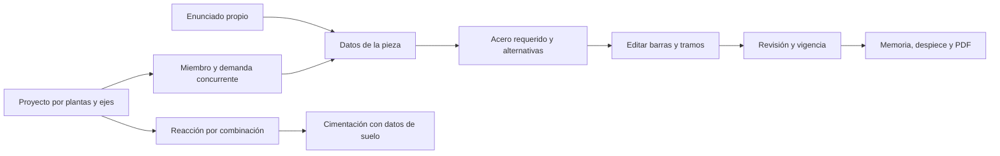

# Próxima ampliación de FStructure: proyecto, armado y resolución propia

Fecha de investigación: **9 de octubre de 2026**. Base local: `d0df71c3685856d910cd1edbb08dce4fd6249d44`.

Estado: **investigación y propuesta de producto**, con lectura de código y licencias. Los paquetes externos no se instalaron ni se ejecutaron; este estudio no aporta nuevas validaciones numéricas ni implementa sus funcionalidades propuestas.

## Recomendación

Construir un flujo continuo para **seleccionar una pieza del edificio, revisar sus demandas, editar el armado y producir una entrega reproducible**. La misma pieza debe poder empezar con los datos de un ejercicio propio. Geometría, cargas, acero, resultados y procedencia deben permanecer juntos.

El primer salto recomendado combina un editor de armado por tramos, resolución explicada de acero requerido, revisión vinculada al modelo y alternativas de armado. Una segunda entrega cierra reacciones → cimentación y cantidades/despiece. Losas y muros requieren subsistemas y comprobaciones separados.

El propósito sigue siendo viviendas y edificios de concreto armado, piezas independientes y tareas con datos del profesor. Se conservan el trabajo local, el proyecto único, el guardado anterior y una interfaz básica con detalles progresivos. No se recuperan ejemplos resueltos como sustituto del problema de la persona.

## Qué se revisó

- Código actual de FStructure, su TODO y la investigación histórica del [25 de septiembre](concrete-design/CONCRETE_DESIGN_RESEARCH.md). Esa investigación describe una versión anterior; sus huecos no se asumen pendientes hoy.
- Ocho repositorios públicos: PyNite, concrete-properties, section-properties, StructuralCodes, IfcOpenShell/Bonsai, OpenSees, OSAFE y FreeCAD-Reinforcement. Se leyeron archivos concretos y se fijaron los commits consultados.
- Dos imágenes públicas de los checkouts de OSAFE y FreeCAD-Reinforcement para observar ubicación de elementos, representación de barras y organización de objetos. No se ejecutaron esas aplicaciones de escritorio ni se probó su usabilidad.
- Se intentó consultar las páginas oficiales de ETABS, CYPECAD, SkyCiv, Ftool y RISA. El proxy respondió **403**. Sus referencias comerciales de la investigación anterior se consideran históricas, sin afirmar una nueva inspección de producto o versión.
- Agentes Luna con razonamiento alto investigaron por separado los flujos locales, los motores y los proyectos de edificios. Los informes originales y el registro de acceso permanecen en `qa-artifacts/investigacion-grande-2026-10-09/`, ignorado por Git.

## Capacidades actuales: ampliar desde lo que ya existe

| Área | Ya existe | Mejora concreta pendiente |
| --- | --- | --- |
| Proyecto | Modelos 2D/3D, rejilla, niveles, plantillas de edificio y diseño por ejes/nivel | Navegador cruzado planta/eje/tabla y revisión independiente de una pieza con procedencia conservada |
| Ejercicio | Tres formularios propios, propuesta de acero y datos incompletos conservables | Explicar As requerida, mínima y proporcionada, y el cálculo del enunciado propio |
| Viga | Rectangular/T/L, voladizos, continua; una carga puntual CM y una CV por claro, con posición común | Varias cargas puntuales en posiciones distintas y distribuidas parciales o variables en la pieza independiente; en Pórtico rápido faltan puntuales/voladizos |
| Armado de viga | Corridas, capas y bastones propuestos; el motor admite bastones `custom` y `stirrupZones` | Editor que capture esos bastones y zonas; hoy el adaptador del formulario envía `auto`/`none` y separación uniforme |
| Columna/sección | Propuesta de acero fijo, comprobación biaxial de columna, grupos separados y dibujos | Alternativas constructivas, edición más visual y análisis de contornos arbitrarios con equilibrio de sección |
| Cimentación | Familias existentes con datos propios, comprobaciones, dibujos y cantidades | Importar reacciones concurrentes del apoyo y conservar vínculo/revisión del modelo |
| Entrega | Memoria, filtros, PDF completo/selección y cantidades aproximadas | Despiece con marcas y formas, CSV por nivel/diámetro y láminas locales con vigencia y exclusiones |
| Servicio | Flecha y revisión de vigas, recálculo agrietado del modelo | Estado de sección agrietada y momento-curvatura; desarrollar fisuración/flecha diferida según familia y evidencia |

Evidencia local principal:

- [Modelo 2D → Diseño](../../src/design/elements/model2dSource.ts): clasifica casos y recalcula con combinaciones del taller; el comentario del contrato aclara que no consume las combinaciones del modelo tal cual. Esto requiere distinguir origen y transformación, no afirmar que faltan todos los casos/combinaciones.
- [3D → Diseño](../../src/integrations/space3dDesign.ts): ya conserva revisión y traduce demandas de los ejes. La propuesta extiende esa procedencia a la pieza independiente y a la entrega.
- [Plantilla de edificio](../../src/modules/space3d/space3d/engine/buildingTemplate.ts): ya genera niveles, cargas y reparto tributario de losas de la plantilla. Un objeto de losa editable con huecos y transferencia propia sería una ampliación de ese alcance.
- [BeamWorkbench](../../src/features/design/workbench/BeamWorkbench.tsx), [adaptador](../../src/features/design/workbench/beamModel.tsx) y [análisis](../../src/design/elements/beamAnalysis.ts): confirman puntuales y voladizos de la Viga actual, y las limitaciones de edición citadas.
- [Motor de viga](../../src/design/elements/beam.ts): `BeamProvidedReinforcement`, `ProvidedBastion`, `ProvidedStirrupZone`; `BedSection` ya calcula `requiredMm2`, `minimumMm2`, `maximumMm2`, área proporcionada y peralte efectivo. Se puede explicar esta información antes de inventar otro motor.
- [Memoria](../../src/features/design/workbench/designMemory.tsx) y [guardado](../../src/features/design/workbench/workbenchStorage.ts): ya conservan borradores y tienen presupuestos. Las nuevas estructuras necesitan un contrato versionado, sin meter arrays serializados en campos de texto cortos.

## Fuentes abiertas verificadas y uso recomendado

| Proyecto y commit consultado | Evidencia concreta | Qué adoptar o comparar | Licencia/alcance observado |
| --- | --- | --- | --- |
| [PyNite](https://github.com/JWock82/PyNite/tree/ae8c4049181488deaafcc8ed8effbe9d296773ed) | [`FEModel3D.py`](https://github.com/JWock82/PyNite/blob/ae8c4049181488deaafcc8ed8effbe9d296773ed/Pynite/FEModel3D.py), [`PhysMember.py`](https://github.com/JWock82/PyNite/blob/ae8c4049181488deaafcc8ed8effbe9d296773ed/Pynite/PhysMember.py) | Oráculo de desarrollo para reacciones, cargas parciales, fuerzas de miembro y P-Delta | MIT; análisis Python. P-Delta no incluye placas/cuadriláteros; su pushover reciente tiene alcance restringido de acero |
| [concrete-properties](https://github.com/robbievanleeuwen/concrete-properties/tree/13bfb7bfd75b265bcd418e2f8ed72106a0362678) | [`concrete_section.py`](https://github.com/robbievanleeuwen/concrete-properties/blob/13bfb7bfd75b265bcd418e2f8ed72106a0362678/src/concreteproperties/concrete_section.py), [`analysis_section.py`](https://github.com/robbievanleeuwen/concrete-properties/blob/13bfb7bfd75b265bcd418e2f8ed72106a0362678/src/concreteproperties/analysis_section.py) | Contornos propios, propiedades agrietadas, momento-curvatura y equilibrio biaxial N-Mx-My | MIT; capacidad genérica sin reducción normativa por defecto. Sus perfiles AS/NZS no prueban NTC/NSR/E.060 |
| [section-properties](https://github.com/robbievanleeuwen/section-properties/tree/1e12d48b3ccb9ee1b7df8e2ac357c633cc004bdf) | [`analysis/section.py`](https://github.com/robbievanleeuwen/section-properties/blob/1e12d48b3ccb9ee1b7df8e2ac357c633cc004bdf/src/sectionproperties/analysis/section.py) | Área, centroide, inercias y propiedades de contornos compuestos; comparación para secciones libres | MIT; motor de propiedades elásticas, no diseño de acero de refuerzo por norma |
| [StructuralCodes](https://github.com/fib-international/structuralcodes/tree/3e9c3f5cffb0c28e083257346006c7eac02384fd) | [`ec2_2004/shear.py`](https://github.com/fib-international/structuralcodes/blob/3e9c3f5cffb0c28e083257346006c7eac02384fd/structuralcodes/codes/ec2_2004/shear.py), [`LICENSE`](https://github.com/fib-international/structuralcodes/blob/3e9c3f5cffb0c28e083257346006c7eac02384fd/LICENSE) | Separación por edición, funciones con unidades/referencias, casos de materiales y servicio | Apache-2.0; las ecuaciones europeas no se trasladan a otros perfiles sin verificar su evidencia |
| [IfcOpenShell/Bonsai](https://github.com/IfcOpenShell/IfcOpenShell/tree/cc5cd788bed3f04430096bb851b157f0bdd15451) | [`spatial/data.py`](https://github.com/IfcOpenShell/IfcOpenShell/blob/cc5cd788bed3f04430096bb851b157f0bdd15451/src/bonsai/bonsai/bim/module/spatial/data.py), [`model/grid.py`](https://github.com/IfcOpenShell/IfcOpenShell/blob/cc5cd788bed3f04430096bb851b157f0bdd15451/src/bonsai/bonsai/bim/module/model/grid.py), [`qto/helper.py`](https://github.com/IfcOpenShell/IfcOpenShell/blob/cc5cd788bed3f04430096bb851b157f0bdd15451/src/bonsai/bonsai/bim/module/qto/helper.py) | Patrones de plantas/ejes, contención espacial, selección y cantidades; IFC como fase posterior | Bonsai GPL-3; biblioteca Python declara LGPL-3.0-or-later. Componentes distintos, no una licencia uniforme del monorepo |
| [OpenSees](https://github.com/OpenSees/OpenSees/tree/3c546b43be9b837db34083296310a60b3eb8280d) | [`LoadPattern.cpp`](https://github.com/OpenSees/OpenSees/blob/3c546b43be9b837db34083296310a60b3eb8280d/SRC/domain/pattern/LoadPattern.cpp), [`COPYRIGHT`](https://github.com/OpenSees/OpenSees/blob/3c546b43be9b837db34083296310a60b3eb8280d/COPYRIGHT) | Referencia de patrón de carga, transformación de ejes y futura comparación de análisis no lineal | Licencia propia con condiciones educativas/investigación/no comerciales y permiso para incorporación comercial; no integrarlo como dependencia en esta propuesta |
| [OSAFE](https://github.com/ebrahimraeyat/OSAFE/tree/50fde6d824ba485636492addb1d693fd68851c13) | [`osafe_rebar.py`](https://github.com/ebrahimraeyat/OSAFE/blob/50fde6d824ba485636492addb1d693fd68851c13/osafe_objects/osafe_rebar.py), [`export.py`](https://github.com/ebrahimraeyat/OSAFE/blob/50fde6d824ba485636492addb1d693fd68851c13/osafe_import_export/export.py), [imagen inspeccionada](https://github.com/ebrahimraeyat/OSAFE/blob/50fde6d824ba485636492addb1d693fd68851c13/help/figures/punch.png) | Vínculo cimentación-refuerzo, longitudes/pesos y ubicación de revisión; PDF/Excel/DXF como patrón | Raíz GPL-3; `osafe_rebar.py` tiene cabecera LGPL-2+. Revisar atribución de cada componente antes de reutilizar; el README declara punzonamiento ACI 318-19, sin validarlo aquí |
| [FreeCAD-Reinforcement](https://github.com/amrit3701/FreeCAD-Reinforcement/tree/9f424aca0b0ada2521fab3927108af4e23eccdc0) | [`BBSfunc.py`](https://github.com/amrit3701/FreeCAD-Reinforcement/blob/9f424aca0b0ada2521fab3927108af4e23eccdc0/BarBendingSchedule/BBSfunc.py), [captura inspeccionada](https://github.com/amrit3701/FreeCAD-Reinforcement/blob/9f424aca0b0ada2521fab3927108af4e23eccdc0/icons/wiki/ReinforcementWorkbenchWindow.png) | Despiece por marca/pieza/diámetro, cantidades, longitudes, formas acotadas y representación espacial de barras | Cabeceras LGPL-2+, sin licencia raíz encontrada. Es un generador de geometría/despiece, no prueba de resistencia de las barras |

La aplicación conserva su motor TypeScript y funcionamiento local. Las bibliotecas Python pueden servir para generar fixtures de desarrollo con versión, unidades, hipótesis y tolerancia explícitas. No se propone instalar FreeCAD/Blender ni enviar proyectos a un backend para usar la app.

## Tres enfoques posibles

| Enfoque | Beneficio | Coste/dependencia | Recomendación |
| --- | --- | --- | --- |
| Unir proyecto → pieza → armado → entrega | Hace más útil el alcance actual, reduce recaptura y conecta problemas propios con trabajo de edificio | Nuevo estado versionado, contratos de procedencia y editor físico | **Primero** |
| Ampliar directamente a losas y muros | Mayor cobertura para vivienda/edificio | Cada familia necesita análisis, normas, servicio, detalle y referencias; la losa de placa exige más que un reparto tributario | Después, una subfamilia por entrega |
| Incorporar un motor abierto completo | Capacidad técnica amplia en teoría | Python/C++, dependencias, licencias, peso, diferencia de normas y operación offline | Usar como referencia/oráculo; no reemplazar el motor actual |

## Propuestas priorizadas

### 1. Resolver el acero del enunciado propio con explicación

Entrada inicial: objetivo **calcular acero**, **verificar armado dado** o **dimensionar sección**. Mostrar exclusivamente los datos necesarios para ese objetivo y desplegar lo avanzado.

Para la primera familia verificada de flexión de viga rectangular: exponer As requerida, As mínima/máxima, d calculado con barras reales, resistencia, As proporcionada y razón de la selección. Mostrar sustitución de valores y unidades, con referencia y edición. La opción de propuesta discreta debe continuar siendo distinta del cálculo de área requerida.

No usar una fórmula de flexión simple para afirmar que resolvió una columna N-Mx-My, una sección libre, torsión o cortante. El momento del enunciado es una acción directa: nunca convertirlo silenciosamente en una carga equivalente sobre un claro inventado. Este modo amplía los formularios propios ya existentes.

### 2. Editar barras, bastones y estribos sobre la pieza

Una lámina con tramo de la viga y corte asociado. Se selecciona una región, se fijan inicio/fin, número y diámetro de bastones, y separación de estribos en extremos/centro. Los controles numéricos acompañan al gesto para permitir precisión y teclado.

Aprovechar `customBastions` y `stirrupZones` del motor actual, extender el borrador versionado y dibujar la misma geometría que se revisa. El editor debe detectar solapes de bastones, huecos de tramo, desarrollo insuficiente, barras fuera del concreto, recubrimiento y separación. Ganchos/grapas y paquetes en contacto se habilitan por familia sólo con evidencia de su alcance.

### 3. Comparar alternativas que sean fáciles de construir

Ofrecer hasta tres alternativas: menor cantidad de acero, menor variedad de diámetros y preferencia de barras disponibles. Comparar cantidad, separación, capas, cambios de estribo, verificaciones y peso aproximado; los precios son opcionales y escritos por la persona.

El mínimo As no implica automáticamente la solución más fácil de colocar. La propuesta debe respetar las dimensiones fijadas, las existencias elegidas y cada check evaluado; comunicar si no hay alternativa factible. Aplicar una alternativa es explícito y deshacible; cambiar entradas o cancelar invalida cualquier búsqueda anterior.

### 4. Abrir una revisión propia desde el edificio

Seleccionar miembro → ver demanda/combinación/estación → crear revisión vinculada. Conservar geometría, materiales, ID, ejes/unidades, revisión del modelo y vector de acciones concurrentes.

La pieza puede conservarse, compararse, convertirse en alternativa independiente y volver al miembro original. Si cambian cargas o modelo, mostrar que la instantánea está desactualizada y ofrecer actualizar; no sustituir manualmente sus valores sin una acción explícita.

No construir una demanda sumando máximos de casos incompatibles. Mantener juntos N, Mx, My, V y T del mismo estado, y mostrar qué transformación de casos/combinaciones realiza el adaptador de Diseño.

### 5. Organizar el edificio por planta y eje

Navegador ligero con plantas, ejes y elementos; filtros por familia, incompletos y estado de revisión. Tabla, planta y escena seleccionan la misma pieza. Permitir revisar materiales/secciones de un conjunto con una vista previa del alcance de la edición.

Se extiende la rejilla/niveles del 3D existente. Los elementos sin asignación permanecen visibles. Diseño y 3D siguen intercambiando DTO por los puentes del workspace, sin importar la interfaz del otro territorio.

### 6. Pasar reacciones a cimentación y cerrar la ruta de carga

Desde el apoyo del edificio, escoger una reacción concurrente por combinación y abrir la cimentación con N/M/V, ubicación y procedencia. Pedir datos geotécnicos faltantes, mostrando qué servicio y estado último se transfieren.

Empezar por la familia de zapata aislada cuyo motor ya puede comprobar las acciones elegidas. Las restantes familias conservan sus límites y se amplían por separado; importar una reacción no prueba asentamiento ni comportamiento real del suelo.

### 7. Despiece y cantidades utilizables

Tabla de marca, pieza, diámetro, forma, número, longitud unitaria/total y peso; agrupar por piso y por diámetro. Distinguir longitud geométrica, desarrollo/empalmes calculados y desperdicio supuesto. Una medida no resuelta queda pendiente, no recibe un valor inventado.

Primera salida: CSV seguro, SVG acotado y PDF. Evitar fórmulas ejecutables derivadas de texto libre en CSV. DXF e IFC van después como exportadores aislados, con unidades, IDs y comprobación de relectura. Estas salidas amplían las cantidades/PDF que ya existen.

### 8. Losa maciza unidireccional como primera familia nueva

Modelo editable de contorno, espesor, dirección de trabajo y cargas superficiales, con transferencia tributaria visible hacia vigas. Elegir explícitamente apoyos y continuidad; comprobar equilibrio del reparto, y después flexión/cortante, servicio y detalle con una primera norma registrada.

La sección experimental de losa por metro y el reparto de la plantilla no constituyen ese diseño completo. Placa bidireccional, huecos complejos, punzonamiento y losa plana requieren otra etapa con su método de análisis y fixtures.

### 9. Secciones propias, capacidad biaxial y servicio

Editor de polígono/huecos, regiones y coordenadas de barras; validar geometría, intersecciones, recubrimiento y ejes. Añadir mapa Mx-My a N fijado, capacidad nominal/reducida identificada, eje neutro y deformación de cada barra. Comparar contra concrete-properties sólo después de igualar leyes de materiales y convenciones.

Luego desarrollar propiedades agrietadas y momento-curvatura. Ancho de grieta, fluencia, retracción y flecha diferida requieren hipótesis/cargas/datos y referencias propias; una sección agrietada genérica no aprueba por sí sola esos estados de servicio.

## Entregas recomendadas

| Entrega | Alcance concreto | Condición de cierre |
| --- | --- | --- |
| A · Resolver y editar acero | Objetivos claros del ejercicio, As requerida/mínima/proporcionada en la primera familia, editor de bastones/estribos y comparación de alternativas | Un problema propio llega a dibujo/armado/explicación/guardado/PDF; motor y lámina coinciden; datos heredados abren |
| B · Pieza del edificio | Instantánea de demanda y origen, revisión vinculada, navegador por planta/eje, advertencia de desactualización | Elegir una barra de un edificio existente, editar su revisión, cambiar el modelo y detectar el origen obsoleto sin perder borradores |
| C · Cimentación y despiece | Reacción → zapata aislada, marcas/longitudes/cantidades, CSV/SVG/PDF por selección/nivel | Reacción, combinación y unidades coinciden; despiece reconciliado con barras; datos geotécnicos explícitos y exclusiones conservadas |
| D · Ampliación de familias | Primera losa unidireccional; después sección libre/biaxial/servicio. Muros estructurales y contención tienen proyectos separados | Fuente normativa registrada, referencia numérica independiente y caso de extremo a extremo para cada nueva familia |

Son bloques de implementación separados. No se fija una fecha ni se promete reunir todos los subsistemas en un cambio monolítico. Cada entrega tiene un diseño/plan propio, migración cuando corresponda y revisión de código.

## Arquitectura y datos a cuidar en la primera entrega

- Los motores mantienen funciones puras, unidades explícitas y coordenadas compartidas por revisión/dibujo. Búsquedas y cálculo pesado van en workers con mensajes serializables y cancelación.
- El nuevo estado debe separar **entrada de cargas**, **acciones dadas** y **demanda de una instantánea de modelo**. Ninguno simula otro para activar un motor incompatible.
- Un contrato de procedencia incluye origen, proyecto/miembro, revisión, caso/combinación, estación, convención de ejes, unidades y acciones concurrentes. Hay que especificar la evaluación de vigencia al abrir y al editar.
- Arrays de bastones, cargas o filas de despiece no caben de forma segura dentro de los campos cortos actuales. Diseñar un documento tipado de nueva versión, con cotas de tamaño/cantidad y migraciones de v1–v6, preservando también datos desconocidos heredados. No aflojar límites ni sobrescribir campos silenciosamente.
- La Home transmite intención y conserva carga diferida; los editores viven en su territorio. El edificio aporta datos por `src/integrations` y adaptadores del workspace.
- IFC/DXF y motores de referencia se evalúan aparte. Esta propuesta no añade un backend, dependencias de escritorio ni envío implícito de datos de proyecto.

## Verificación necesaria antes de llamar completa una entrega

1. Caso pequeño de referencia para cada cálculo nuevo, con tolerancia y procedencia. PyNite/otras librerías sólo se cuentan como oráculo cuando realmente se ejecuten, con versión fijada.
2. Equilibrio global de cargas y reacciones; mismo caso para el vector de acciones; convenciones local/global y signos probadas.
3. Área y coordenadas del armado idénticas en cálculo, lámina, cantidades y exportación; congestión y geometría imposible rechazadas.
4. Guardar/reabrir, migraciones antiguas, importación inválida, documento lleno y cancelación sin mutar el trabajo anterior.
5. Navegador Día/Noche y teléfono, teclado y controles precisos; edición de una pieza sin perder la selección/contexto del proyecto.
6. Registro normativo por edición/familia, distinción entre cumple/no cumple/no evaluado/Experimental y vigencia visible en la entrega.

## Referencias comerciales: límites de esta comparación

La investigación histórica documenta patrones de ETABS (miembro/combinación/estación), CYPECAD (plantas/elementos/entrega), SkyCiv (edición de refuerzo y cálculos visibles), SAFE/CSiCOL y otros. Esos patrones sirven como preguntas de diseño. El 9 de octubre sus sitios consultados fueron bloqueados por el proxy, por lo que no se afirma una nueva comparación visual, prueba de software, verificación de precios ni cobertura normativa de sus versiones actuales.

El respaldo verificable de las recomendaciones de este documento es el código de FStructure y los repositorios congelados de la tabla anterior. Licencia permisiva, popularidad, un README o una imagen no demuestran precisión ni cumplimiento normativo.
